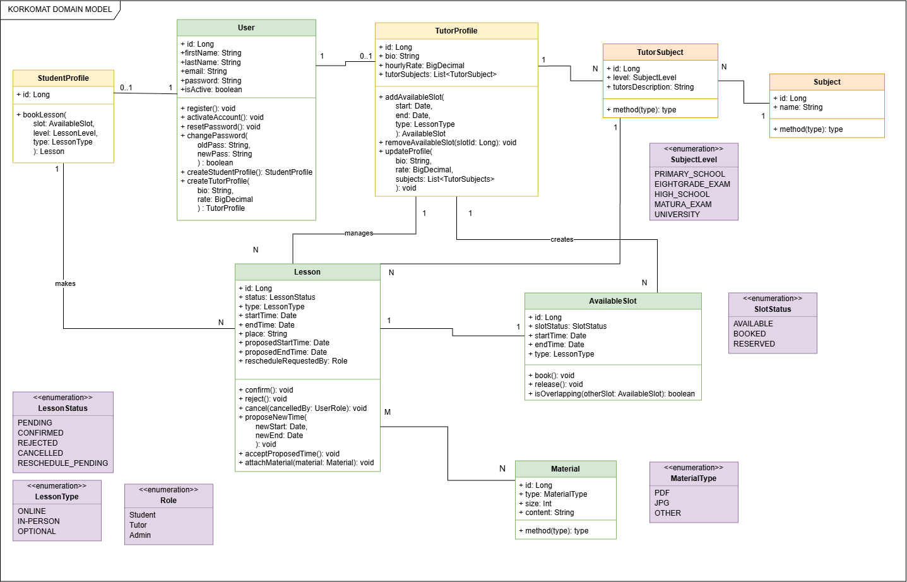

# KORKOMAT

**KORKOMAT** is a web application for managing and scheduling private tutoring lessons.

The project aims to simplify the process of organizing lessons by providing a central place where tutors can manage their availability and students can browse and sign up for available lesson slots.

The application is being developed as a portfolio project with the possibility of using it in real tutoring activities.

## Tech Stack

* **Kotlin**
* **Spring Boot**
* **Spring Data JPA / Hibernate**
* **Spring Security**
* **PostgreSQL**
* **Gradle**
* **Postman**
* **Docker**

## Current Features
The project has almost reached MVP-level functionality, with only a few features left to implement.

- Authentication
  - Users can register and authenticate in the application.
  - Email verification during registration
  - Passwords are securely stored using password hashing.
  - Forgot password via email confirmation
  - JWT-based authentication and refresh tokens are implemented.
- User Profiles
  - Users can create student or tutor profile.
  - Available actions depend on the user's profile and assigned role.
  - Basic administration features are available.
- Subjects
  - Administrators can manage available subjects.
  - Tutors can add, edit and delete subjects they teach along with additional information.
  - Students can browse tutors and view the subjects they offer.
- Availability Slots
   - Tutors can create, update, and delete their available slots.
   - The system prevents creating invalid slots.
   - Students can browse and filter available slots.
   - Slot availability is automatically updated during the lesson booking process.
- Lessons
  - Students can book available lesson slots.
  - The system prevents booking unavailable slots and detects scheduling conflicts.
  - Booked lessons can be confirmed or rejected by the tutor.
  - Lesson and slot statuses are updated according to the booking workflow.
  - Students can freely cancel reservations until tutor's confirmation.


## Upcoming Features
- Automated testing
- Lesson cancellation requests (after its confirmation)
- Lesson rescheduling
- Extended administration features
- Frontend application

## Domain Model



## Getting Started

Clone the repository:

```bash
git clone https://github.com/YOUR_USERNAME/korkomat.git
cd korkomat
```

Run the application using Gradle:

```bash
./gradlew bootRun
```

On Windows:

```bash
gradlew.bat bootRun
```

## License

This project is developed for educational and portfolio purposes.
