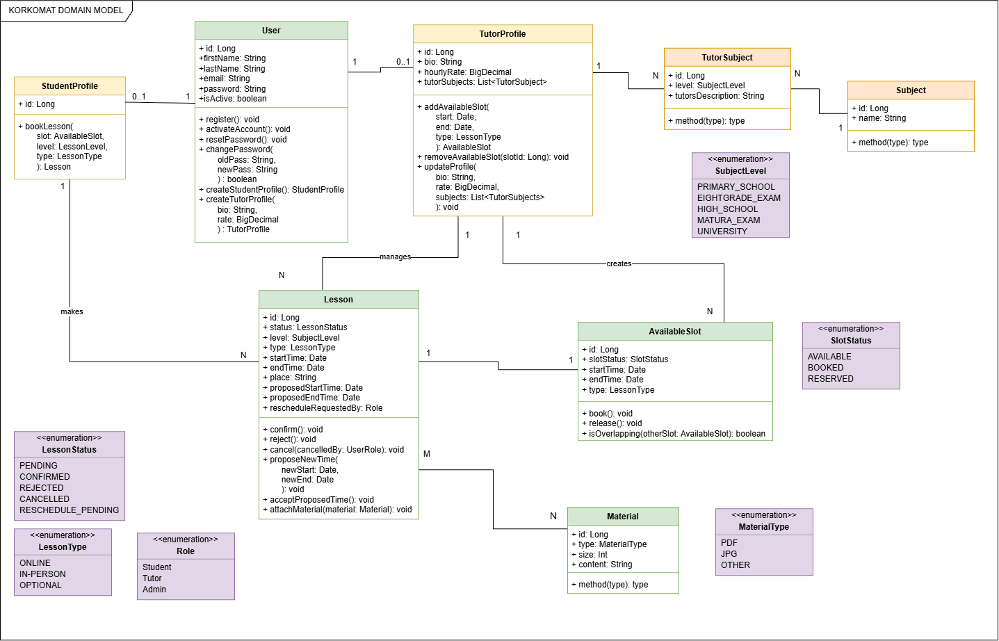

# KORKOMAT

**KORKOMAT** is a web application for managing and scheduling private tutoring lessons.

The project aims to simplify the process of organizing lessons by providing a central place where tutors can manage their availability and students can browse and sign up for available lesson slots.

The application is being developed as a portfolio project with the possibility of using it in real tutoring activities.

## Tech Stack

* **Kotlin**
* **Spring Boot**
* **Spring Data JPA / Hibernate**
* **Spring Security**
* **PostgreSQL**
* **Gradle**
* **JUnit / Testcontainers**
* **Docker**

## Project Status

🚧 **Work in Progress**

The project is currently in the early development stage. The initial focus is on designing the domain model and implementing the core functionality of the MVP.

## Planned MVP

* User registration and authentication
* Student and tutor profiles
* Tutor availability management
* Lesson scheduling
* Student lesson registration
* Basic lesson management

## Domain Model



## Getting Started

Clone the repository:

```bash
git clone https://github.com/YOUR_USERNAME/korkomat.git
cd korkomat
```

Run the application using Gradle:

```bash
./gradlew bootRun
```

On Windows:

```bash
gradlew.bat bootRun
```

## License

This project is developed for educational and portfolio purposes.
